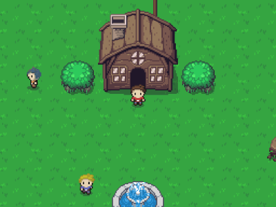
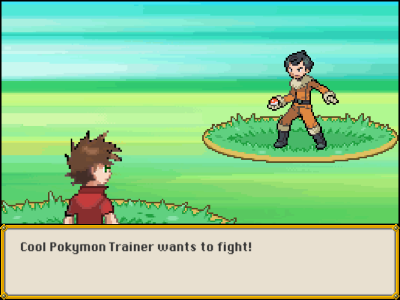
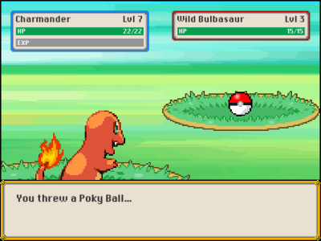

# Pokymon

Pokymon is a Pokémon-like RPG videogame developed while taking [this Unity course on Udemy](https://www.udemy.com/share/106hyQ3@xr27n-py3L5eQSWov5eMF2nOb4sNUg72v-tENWzunyGr3MIeZa0yzkEfk6i04t01/).

## Disclaimers

> This game has been developed for learning purposes only. It doesn't and will never implement all original Pokémon features, characters, scenarios and whatsoever.

> Pokémon and Pokémon character images & names are trademarks of Nintendo. No copyright or trademark infringement is intended.

## Video (with sound)

https://user-images.githubusercontent.com/14996002/178304247-499f13ce-0290-4a93-824c-be9dfa04e726.mp4

## Screenshots
 &nbsp; 

 &nbsp; 

 &nbsp; 

## Credits

### Art
- **World tilesets & character sprites:** Armando Montero AKA ArMM1998 @ https://opengameart.org/content/zelda-like-tilesets-and-sprites
- **Pokémon sprites:** Lexy Munroe AKA eevee @ https://veekun.com/dex/downloads
- **Pokéball sprites:** Daniel AKA Earcl01 @ https://www.deviantart.com/earcl01/art/pokeballs-sprites-215842166
- **Trainer battle sprites:** Rubire4 @ https://whackahack.com/foro/threads/mega-aporte-todos-los-trainer-sprites-de-dppt-adaptados-para-gba.54957/
- **Player battle sprites:** NunnyGold @ https://whackahack.com/foro/threads/fr-cambia-de-backsprite-de-entrenador-dentro-del-juego.49393/
- **Battle backgrounds:** Professor Valley @ https://www.spriters-resource.com/ds_dsi/pokemonplatinum/sheet/18502
- **Battle dialog boxes:** Unknown @ http://clipart-library.com/clipart/8ixrMpdBT.htm
- **Font:** Ingo Zimmermann AKA ingoFonts @ https://www.dafont.com/es/depixel.font

### Sound
- **World music:** Vinicius Nipote AKA TFSui @ https://assetstore.unity.com/packages/audio/music/toon-adventure-soundtrack-60684
- **Battle music:** Vinicius Nipote AKA TFSui @ https://assetstore.unity.com/packages/audio/music/toon-battle-soundtrack-60676
- **Battle SFX:** Juhani Junkala AKA SubspaceAudio @ https://opengameart.org/content/512-sound-effects-8-bit-style

### Data
- **Pokymon list:** Unknown @ https://bulbapedia.bulbagarden.net/wiki/List_of_Pok%C3%A9mon_by_base_stats_(Generation_VIII-present)
- **Moves list:** Unknown @ https://bulbapedia.bulbagarden.net/wiki/List_of_moves
- **Damage formula:** Unknown @ https://bulbapedia.bulbagarden.net/wiki/Damage
- **Catch rate formula:** Unknown @ https://bulbapedia.bulbagarden.net/wiki/Catch_rate
- **Run from battle formula:** Unknown @ https://bulbapedia.bulbagarden.net/wiki/Escape
- **Experience formulas:** Unknown @ https://bulbapedia.bulbagarden.net/wiki/Experience
- **Type effectiveness chart:** Unknown @ https://pokemondb.net/type

### Code
- **Main source:** Joanby AKA Juan Gabriel Gomila @ https://github.com/joanby/curso-unity-2021
- **DOTween 2D animation engine:** Daniele Giardini AKA DEMIGIANT @ https://demigiant.com/plugins/dotween/index.php
- **My personal touch:** Brian Baidal AKA Drakhart @ Right here
